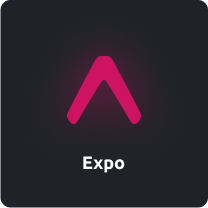

 #  Hi, my name is Luiz Fernando!

  
  

### 🔭 I'm a full-stack software engineer, studying everything about development and technology!

### ✨ Take a look at my pinned projects to see what I can do.

### 📫 Want to contact me? Send me an email! **luizfernandoklein@live.com**

### 🔥 Techs that I use:

  
  
  
  
  
  
  
  

### ☄ Stats

  

  

	< keep coding /> 🚀 ❤️

